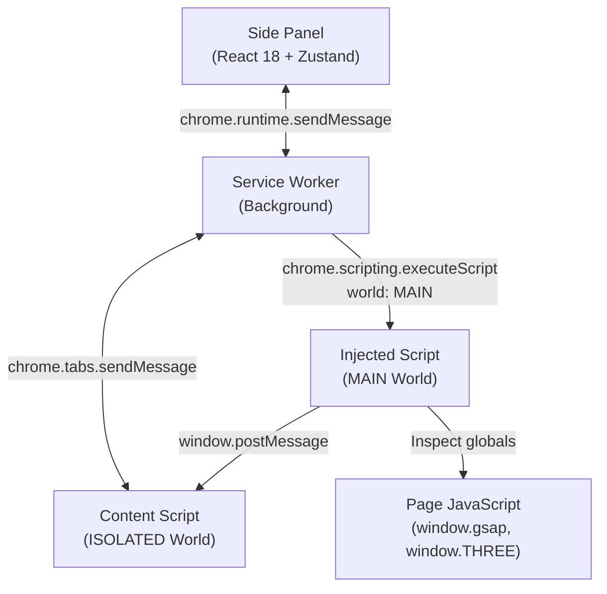

# StyleSnap ⚡

> **Extract any website's design system in one click** — tokens, components, assets, motion architecture, and AI-optimized prompts.

[](https://github.com/SohamB-ai/StyleSnap)
[](https://developer.chrome.com/docs/extensions/mv3/intro/)
[](https://react.dev)
[](https://tailwindcss.com)
[](https://www.typescriptlang.org)

StyleSnap is a production-grade **Manifest V3 Chrome extension** built with React 18, TypeScript, Tailwind CSS, and Vite. It runs in the native Chrome Side Panel and delivers a complete design system from any live web page without external APIs or backend servers.

---

## 🚀 Key Features by Version

### Version 1 — Core Parity
- **Design Token Extraction**: Colors (with HSL, occurrence frequency, semantic roles), Typography (families, weights, scale, line-height, letter-spacing), Spacing grid, Border radii, Box shadows, Z-Index scale, and Breakpoints.
- **Export Formats**: W3C DTCG `tokens.json`, `DESIGN.md`, `tailwind.config.js`.
- **Element Inspector**: Live hover overlay with computed CSS & outerHTML one-click copying.
- **Asset Finder**: Scan and preview all images, SVGs, icons, and favicons with ZIP archive download.
- **Local History**: Stored in `chrome.storage.local` and IndexedDB.

### Version 2 — Deep Accuracy & Multi-Agent Prompts
- **Section Layout Extraction**: Analyzes page sections (Hero, Navigation, Features, Footer), Flex/Grid structures, column counts, gap values, and responsive rules.
- **Component Pattern Detection**: Recurring UI pattern detection (Buttons, Cards, Forms, Dialogs, Badges) with semantic HTML and non-default CSS.
- **Multi-Agent AI Prompt Engine**: Tailored prompts for **Cursor**, **Claude Code** (`SKILL.md`), **v0 by Vercel** (shadcn/ui), **Bolt.new**, and **Lovable** (MLP framework).
- **Full-Page Screenshot Stitcher**: Viewport tile capture and stitching directly in-browser.

### Version 3 — Dynamic Motion, 3D/WebGL & Site-Diff
- **Animation & Scroll Detection**:
  - **Tier 1 (High Accuracy, ≥90%)**: Detects runtime library globals and extracts exact configuration parameters:
    - **GSAP & ScrollTrigger**: Pinning states, scrub values, start/end triggers, easing.
    - **AOS (Animate on Scroll)**: Duration, offset, easing, per-animation element counts.
    - **Lenis**: Smooth scroll duration, easing, orientation, smooth wheel.
    - **Locomotive Scroll**: Scroll direction, speed, delay.
  - **Tier 2 (Heuristic)**:
    - **Framer Motion**: Detects layout animations, motion components, CSS custom properties (`--framer-*`).
    - **ScrollMagic**: Controller detection.
  - **Tier 3 (DOM Scan)**: CSS transitions, computed `@keyframes`, and IntersectionObserver patterns.
- **3D & WebGL Detection**:
  - **Three.js**: Revision number, canvas counts, WebGL 1/2 contexts, GPU unmasked renderer/vendor info.
  - **Spline**: `<spline-viewer>` embed detection with scene URLs.
  - **CSS 3D Transforms**: `perspective`, `transform-style: preserve-3d`, `matrix3d`.
- **Site-Diff Engine**:
  - Side-by-side comparison between any two extractions (or historical checkpoints).
  - Calculates overall similarity score (0–100%).
  - Token diffs (added/removed/modified colors, typography, spacing, shadows).
  - Layout & component variance reporting.
  - Animation footprint diffing.

---

## 🛠️ Architecture

StyleSnap operates across 5 execution contexts:



---

## 📦 Installation & Development

### Prerequisites
- Node.js ≥ 20
- pnpm ≥ 9 (`npm install -g pnpm`)

### Setup
```bash
# Clone the repository
git clone https://github.com/SohamB-ai/StyleSnap.git
cd StyleSnap

# Install dependencies
pnpm install

# Build for production
pnpm run build

# Run verification suite
node scripts/verify-all.mjs
```

### Loading in Google Chrome
1. Open Google Chrome and navigate to `chrome://extensions/`.
2. Toggle on **Developer mode** (top right).
3. Click **Load unpacked** (top left).
4. Select the `dist/` directory inside `StyleSnap/`.
5. Open any website and click the StyleSnap icon in the toolbar (or Side Panel).

---

## 🧪 Verification & Quality

StyleSnap includes an automated verification test suite:
```bash
node scripts/verify-all.mjs
```
The suite verifies:
- W3C DTCG 2025.10 token compliance
- V3 Animation & 3D token inclusion
- AI master prompt generation across all 5 engines
- Semantic HTML and CSS isolation
- Manifest MV3 schema and icon assets

---

## 📄 License

MIT © [Omenova Studio](https://github.com/SohamB-ai)
